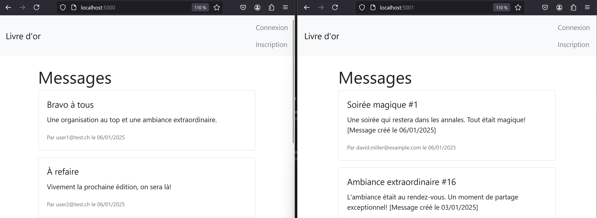
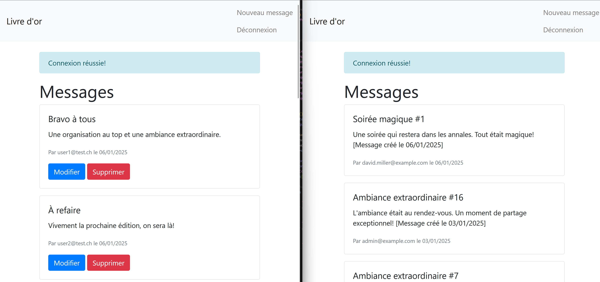
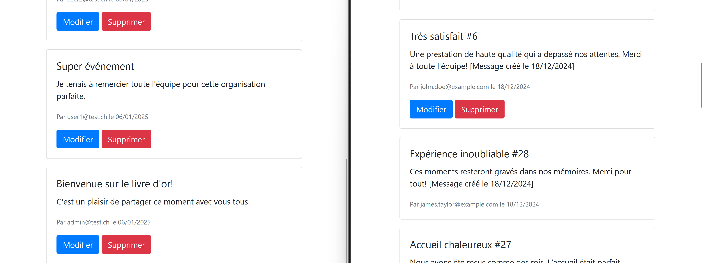
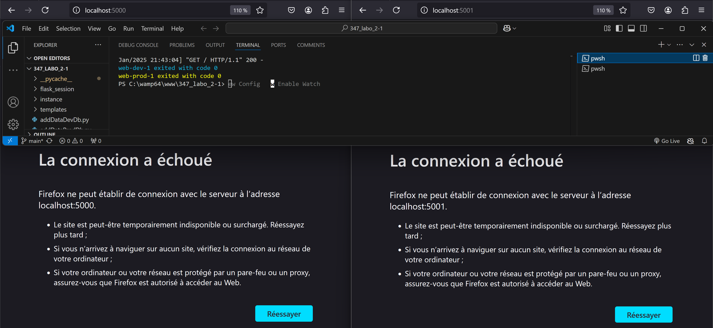
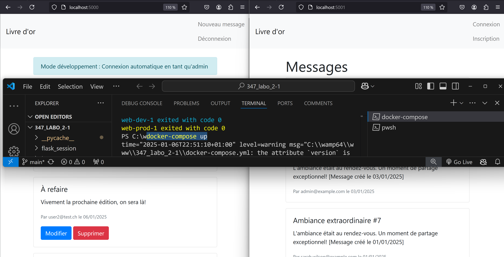

# Livre d'Or - Application Flask

## 1. Structure du Projet

### Arborescence
```bash

livre_dor/
├── instance/
│   ├── dev_guestbook.db    # Base de données de développement
│   └── prod_guestbook.db   # Base de données de production
├── templates/
│   ├── index.html         # Page principale
│   ├── login.html         # Page de connexion
│   └── register.html      # Page d'inscription
├── app.py                 # Application principale
├── models.py             # Modèles de données
├── addDataDevDb.py       # Script de données de dev
├── addDataProdDb.py      # Script de données de prod
├── Dockerfile           # Configuration Docker
├── docker-compose.yml   # Configuration Docker Compose
└── requirements.txt     # Dépendances

```

### 1.1 Fonctionnalités
- Authentification utilisateur (login/register/logout)
- Gestion des rôles (admin/user)
- CRUD des messages du livre d'or
- Auto-login en développement (apres une première connexion lors de l'installation)
- Séparation dev/prod

### 1.2 Installation et Exécution

**Récupération du projet**
```bash
git clone https://github.com/M4skedSquirrel/347_labo_2.git
cd 347_labo_2
```

**Prérequis**
- Docker
- Docker Compose

**Lancement des 2 environnements**

Dans un terminal, lancer la commande suivante :
``` bash
docker-compose up --build 
```

Dans un second terminal, lancer les commandes suivantes :
``` bash
docker-compose exec web-dev python addDataDevDb.py
docker-compose exec web-prod python addDataProdDb.py
```
afin de créer les tables et les données des différents environnements (développement et production).

```text
La commande "docker-compose exec web-prod python addDataProdDb.py
" n'est pas censé ête utilisé dans le monde professionnel, son utilisation est rendue obligatoire pour pouvoir simuler une connexion à une base de données de production.
```
Résultat dans le navigateur :


### 1.3 Architecture Générale

**Technologies**
- Frontend : HTML, Jinja2 Templates
- Backend : Python Flask
- Base de données : SQLite
- ORM : SQLAlchemy
- Authentification : Flask-Login

**Architecture Docker**
- Base commune : python:3.9-slim
- Conteneur dev : 
  - Port 5000
  - Auto-login admin
  - Debug activé
- Conteneur prod :
  - Port 5001
  - Pas d'auto-login
  - Debug désactivé

### 1.4 Environnements

**Développement**
- URL : http://localhost:5000
- Auto-login apres un login initial
   - user : admin@test.ch
   - password : admin
- Mode debug activé
- Base de données : dev_guestbook.db
- 3 utilisateurs de test
- 10 messages de test

**Production**
- URL : http://localhost:5001
- Pas d'auto-login
   - compte admin :
      - user : admin@example.com
      - password : adminPass123
   - compte user :
      - user :john.doe@example.com
      - password : userPass123
- Mode debug désactivé
- Base de données : prod_guestbook.db
- 10 utilisateurs réalistes
- 20 messages de démonstration

Résultat dans le navigateur :


on peut voir à gauche un compte admin qui peut modifier et/ou supprimer les messages
et à droite un compte user qui peut uniquement lire les messages...



...et modifier et/ou supprimer ses propres messages.

Test d'auto-login :
 - on arrete le network:
``` bash
docker compose down
```


 - on relance le network 
``` bash
docker compose up
```

 - puis on rafraichit les pages:


**Explications du docker-compose.yml**

Le fichier docker-compose.yml est structuré pour gérer deux environnements distincts (développement et production) :

**1. Fichiers et Configuration Docker Compose**

- Utilisation de la version 3 de Docker Compose
- Définition de deux services : `web-dev` et `web-prod`
- Volumes persistants pour les bases de données SQLite
- Configuration des ports et des variables d'environnement
- Redémarrage automatique des conteneurs avec `restart: unless-stopped`

**2. Application et Déploiement**

- Build multi-stage (Dockerfile) avec deux cibles : development et production
- Montage des fichiers sources via volumes pour le développement en temps réel
- Isolation des données entre dev et prod grâce aux volumes nommés
- Ports différents : 5000 (dev) et 5001 (prod)
- Persistance des données même après redémarrage des conteneurs

**3. Caractéristiques des Environnements**

Développement (web-dev):
- Variable d'environnement FLASK_ENV=development
- Auto-login activé pour faciliter les tests
- Volume sqlite_dev_data pour la base de données de dev
- Hot-reload des modifications grâce au montage du code source

Production (web-prod):
- Variable d'environnement FLASK_ENV=production
- Pas d'auto-login pour plus de sécurité
- Volume sqlite_prod_data pour la base de données de prod
- Isolation complète des données de développement

Les permissions sont gérées via les volumes Docker, permettant l'accès aux fichiers nécessaires pour les vérifications tout en maintenant l'isolation entre les environnements.
